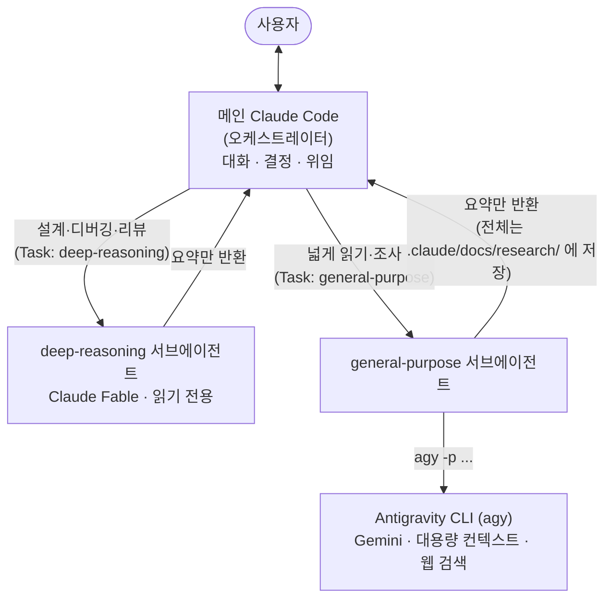
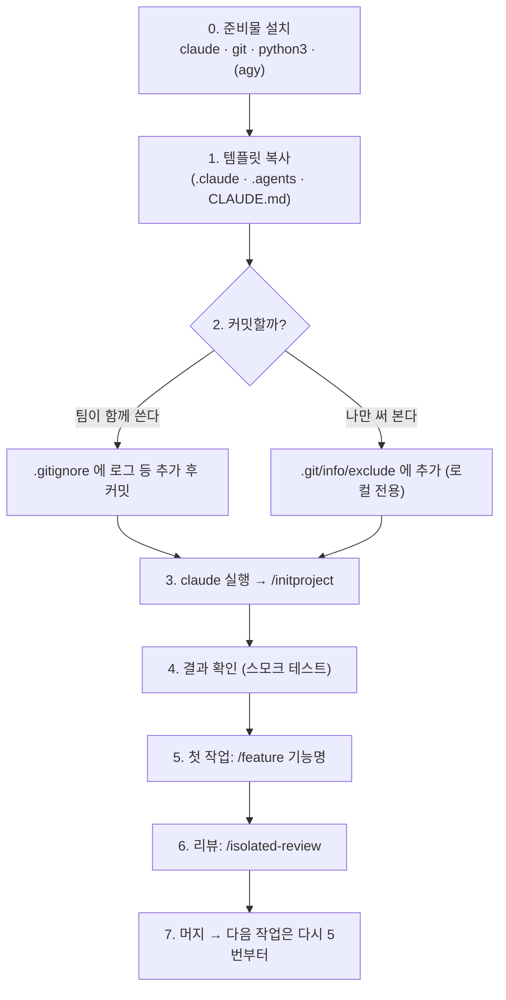
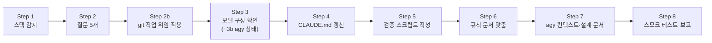
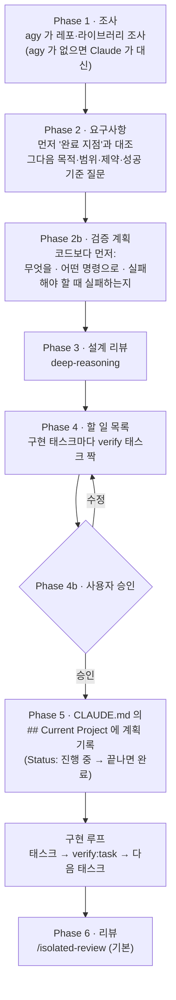
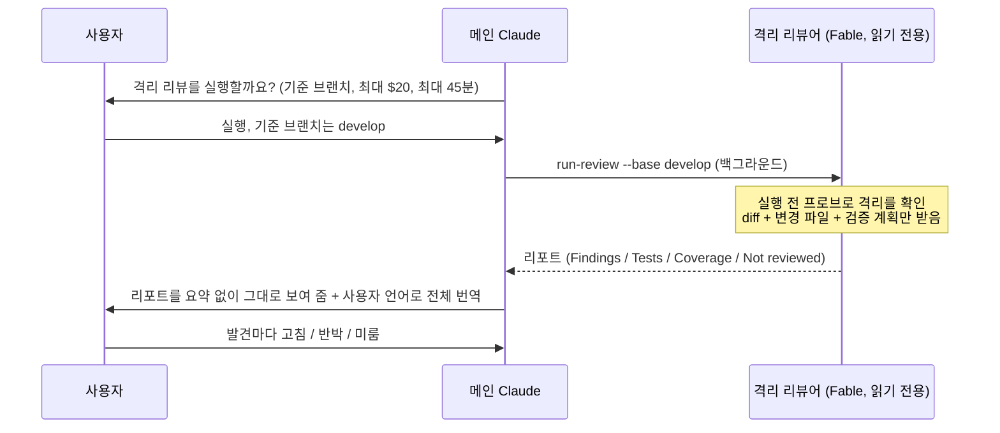
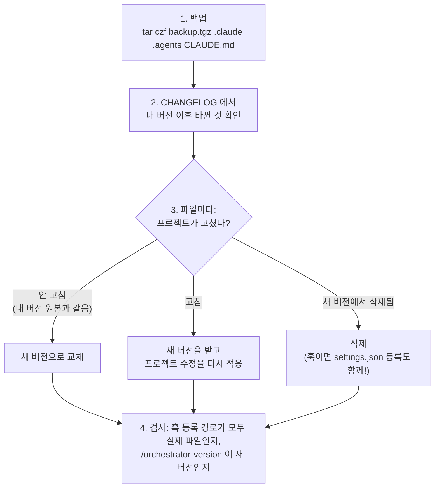

# claude-code-orchestrator

**Claude Code 를 "오케스트레이터"로 쓰게 해 주는 프로젝트 템플릿.**
메인 Claude 는 사용자와 대화하고 결정만 하고, 실제 일은 전문 서브에이전트에게 맡긴다.


> 현재 버전: **3.1.0** — 변경 내역은 [`CHANGELOG.md`](CHANGELOG.md).

## 목차

1. [이게 뭔가요?](#1-이게-뭔가요)
2. [어떻게 동작하나요? (구조)](#2-어떻게-동작하나요-구조)
3. [무엇이 들어 있나요?](#3-무엇이-들어-있나요)
4. [준비물](#4-준비물)
5. [**프로젝트에 적용하기 — 처음부터 끝까지**](#5-프로젝트에-적용하기--처음부터-끝까지)
6. [매일 쓰는 법 — `/feature` 한 바퀴](#6-매일-쓰는-법--feature-한-바퀴)
7. [리뷰 받기 — `/isolated-review`](#7-리뷰-받기--isolated-review)
8. [검증 계약 — `verify-*` 스크립트](#8-검증-계약--verify--스크립트)
9. [버전 확인과 업그레이드](#9-버전-확인과-업그레이드)
10. [실사용 리포트 보내기](#10-실사용-리포트-보내기)
11. [자주 밟는 함정](#11-자주-밟는-함정)
12. [지금 무엇이 검증됐나](#12-지금-무엇이-검증됐나)
13. [이 저장소를 개발하는 사람에게](#13-이-저장소를-개발하는-사람에게)

---

## 1. 이게 뭔가요?

Claude Code 에게 큰 일을 맡기면 금방 **컨텍스트(작업 기억)** 가 찬다. 파일을 많이 읽고, 긴 로그를 보고,
설계를 고민하다 보면 정작 중요한 대화 내용이 밀려난다.

이 템플릿은 그 문제를 **역할 분담**으로 푼다.

| 역할 | 누가 | 하는 일 |
|---|---|---|
| **오케스트레이터** (팀장) | 메인 Claude Code | 사용자와 대화, 할 일 정리, 누구에게 맡길지 결정, 최종 판단 |
| **깊은 추론** (설계 전문가) | `deep-reasoning` 서브에이전트 (Claude Fable) | 설계 검토, 디버깅, 트레이드오프 비교, 코드 리뷰 — **읽기만 한다** |
| **넓게 읽기** (조사 담당) | `general-purpose` 서브에이전트 → **Antigravity CLI (`agy`, Gemini)** | 레포 전체 분석, 라이브러리·웹 조사, PDF·이미지 분석, 긴 출력 요약 |

서브에이전트는 **자기만의 컨텍스트**에서 일하고 **요약만** 돌려준다. 그래서 메인 Claude 의 기억은
가볍게 유지되고, 각자 잘하는 일을 한다.

> **이 템플릿의 판단 기준은 하나다.** 무언가를 더하거나 고칠 때 "위임·컨텍스트 절약·결과 품질 중
> 하나를 낫게 하는가?" 아니면 넣지 않는다. (`CLAUDE.md` 맨 앞에도 같은 문장이 있다.)

---

## 2. 어떻게 동작하나요? (구조)



### 누구에게 시킬지는 "주제"가 아니라 "비용"으로 정한다

| | 생각할 게 적다 | 생각할 게 많다 |
|---|---|---|
| **읽을 게 많다** | **agy** — 로그 요약, "이 함수 쓰는 곳 전부", 큰 파일에서 관련 부분 찾기 | **agy 가 범위를 좁히고 → deep-reasoning 이 판단** |
| **읽을 게 적다** | **메인 Claude 가 직접** | **deep-reasoning** |

**판단은 절대 agy 에게 넘기지 않는다.** agy 는 "어디에 무엇이 있다(`file:line`)"만 알려 주고,
"그게 버그인지·설계가 맞는지"는 Claude 가 정한다.

**"큰 변경"의 기준:** 파일 5개 또는 500줄. 이걸 넘으면 deep-reasoning 앞에 agy 를 두어 범위를 좁힌다.
(보안 경계나 공개 인터페이스를 바꾸는 변경은 크기와 상관없이 항상 "크다".)

### 컨텍스트를 지키는 규칙

| 결과물 크기 | 방법 |
|---|---|
| 1~2문장 | 메인이 직접 |
| 10줄 이상 | 서브에이전트를 거친다 |
| 분석 리포트 | 서브에이전트가 `.claude/docs/` 에 저장하고 요약만 돌려준다 |

---

## 3. 무엇이 들어 있나요?

프로젝트에 복사되는 것은 **`.claude/`, `.agents/`, `CLAUDE.md`** 세 가지뿐이다.

```text
your-project/
├── CLAUDE.md                      # 매 세션 자동으로 읽히는 규칙 (목적·위임·검증·운영 주의)
├── .agents/
│   └── rules/AGENTS.md            # agy 가 읽는 프로젝트 설명
└── .claude/
    ├── ORCHESTRATOR_VERSION       # 이 사본이 어느 릴리스인지 (예: 3.1.0)
    ├── settings.json              # 훅 등록 + 권한(allow / ask / deny)
    ├── agents/                    # 서브에이전트 정의 (deep-reasoning, general-purpose)
    ├── skills/                    # 슬래시 커맨드 (아래 표)
    ├── hooks/                     # 자동 검사 훅 (아래 표)
    ├── rules/                     # 매 세션 읽히는 세부 규칙
    ├── scripts/                   # 검증 계약: verify-save, verify-task (+README)
    └── docs/                      # 설계 기록·조사 결과·작성 가이드
```

### 스킬 (슬래시 커맨드)

| 커맨드 | 언제 | 하는 일 |
|---|---|---|
| **`/initproject`** | 복사 직후 **프로젝트당 한 번** | 스택을 감지하고 템플릿을 이 프로젝트에 맞게 고친다 |
| **`/feature <기능명>`** | **작업 하나마다** | 조사 → 요구사항 → 검증 계획 → 설계 리뷰 → 할 일 목록 → 승인 → 구현 → 리뷰 |
| **`/isolated-review`** | 구현을 커밋한 뒤 | 이 세션과 무관한 격리된 리뷰어가 읽기 전용으로 리뷰한다 |
| `/orchestrator-version` | 버전이 궁금할 때 | 설치된 버전과 최신 릴리스를 비교 |
| `/jira-setup`, `/ticket` | Jira 를 쓰는 팀 | Jira 연결 설정, 티켓에서 작업 시작 |
| `/doc-write` | Confluence·문서 작성 | 작성 규칙에 맞춰 문서를 쓰고 발행 |

### 훅 (자동으로 도는 검사)

| 훅 | 언제 | 하는 일 |
|---|---|---|
| `lint-on-save.py` | Claude 가 Edit/Write 로 파일을 고칠 때 | 그 파일 하나에 `.claude/scripts/verify-save <파일>` 을 돌려 결과를 Claude 에게 알린다 |
| `bash-write-check.py` | Bash 명령 전후 | `sed -i`·리다이렉션처럼 Bash 로 쓴 파일(최대 5개)에도 같은 검사를 돌린다 — 안전망 |
| `log-cli-tools.py` | Bash 로 agy 를 부른 뒤 | agy 입출력을 `.claude/logs/cli-tools.jsonl` 에 기록. **한 줄에 단독으로 부른 호출만** 성공·실패를 판정하고, 나머지(리다이렉트·`\|\| echo`·여러 줄 등)는 `success: null`(UNKNOWN)과 그 이유(`stdout_target`)로 남긴다 |
| `_savecheck.py` | (공용 모듈) | 위 두 검사 훅이 함께 쓰는 코드 |

훅은 **아무것도 막지 않는다** — 알리기만 한다.

---

## 4. 준비물

| 도구 | 필요한가 | 설치 |
|---|---|---|
| **Claude Code** | 필수 | Linux / macOS: `curl -fsSL https://claude.ai/install.sh \| bash` → `claude` 로 로그인. Windows: Claude Code 공식 설치 안내를 따른다 |
| **git** | 필수 | — |
| **Python 3.10 이상** (`python3`) | 필수 — 훅과 스크립트가 쓴다 | OS 패키지 |
| **Antigravity CLI (`agy`)** | 권장 — 없으면 Claude 도구로 대신 조사한다 | Linux / macOS: `curl -fsSL https://antigravity.google/cli/install.sh \| bash` → `agy` 로 Google 로그인 → `agy models`. Windows: Antigravity 공식 안내를 따른다 |
| **GitHub CLI (`gh`)** | 선택 — PR·머지를 Claude 에게 맡길 때 | `gh auth login` |
| **Claude Fable 접근권** | `/isolated-review` 에 필요 — 없으면 사람이 여는 리뷰 세션을 쓴다 | — |

> **agy 가 파일을 읽는 방식:** 헤드리스 호출(`agy -p`)은 기본적으로 파일 읽기를 조용히 건너뛴다(exit 0).
> 그래서 템플릿은 파일을 읽는 호출에 `--dangerously-skip-permissions --sandbox` 를 붙이고, 프롬프트에
> "파일을 만들거나 고치지 말 것"을 항상 넣는다. 더 엄격하게 쓰려면 `~/.gemini/antigravity-cli/settings.json` 에
> `{ "permissions": { "allow": ["read_file(*)"] } }` 를 넣고 플래그를 빼도 된다.

---

## 5. 프로젝트에 적용하기 — 처음부터 끝까지

전체 흐름은 이렇다. **사람이 직접 하는 일은 1~3단계뿐이고**, 나머지는 Claude 가 물어보면서 진행한다.



### 0단계 — 준비물 설치

[4. 준비물](#4-준비물) 표를 따라 설치하고, `claude` 와 `agy` 를 한 번씩 실행해 로그인해 둔다.

### 1단계 — 템플릿 복사 (1분)

먼저 터미널에서 **적용할 프로젝트의 루트 폴더로 이동**한다(`cd <your-project>`). 아래 명령은 모두 그
폴더 안에서 실행한다.

이미 `CLAUDE.md` 나 `.claude/` 가 있는 프로젝트라면, 복사하기 전에 **다른 이름으로 옮겨 백업**한다.
기존 내용은 `/initproject` 가 끝난 뒤 필요한 것만 옮겨 온다.

| OS | 백업 명령 |
|---|---|
| Linux / macOS | `mv .claude .claude.bak && mv CLAUDE.md CLAUDE.md.bak` |
| Windows (PowerShell) | `Rename-Item .claude .claude.bak; Rename-Item CLAUDE.md CLAUDE.md.bak` |

**Linux / macOS** (bash·zsh)

```bash
git clone --depth 1 --branch main https://github.com/GunwooYun/claude-code-orchestrator.git .starter
cp -r .starter/.claude .starter/.agents .starter/CLAUDE.md .
rm -rf .starter
```

**Windows** (PowerShell)

```powershell
git clone --depth 1 --branch main https://github.com/GunwooYun/claude-code-orchestrator.git .starter
Copy-Item -Recurse -Force .starter\.claude, .starter\.agents, .starter\CLAUDE.md .
Remove-Item -Recurse -Force .starter
```

- **`--branch main` 을 꼭 붙인다.** `main` 에는 릴리스된 버전만 있다. 기본 브랜치 `develop` 에는 아직
  검증 중인 변경이 들어 있다.
- 받은 버전은 `.claude/ORCHESTRATOR_VERSION` 에 기록된다.
- **Windows 는 아직 실제로 검증하지 않았다**([12장](#12-지금-무엇이-검증됐나)). 훅은 `python3` 명령으로
  등록돼 있으므로, PowerShell 에서 `python3 --version` 이 Python 3.10 이상을 출력하는지 먼저 확인한다
  (Microsoft Store 설치 안내 창이 뜨면 `python3` 이 실제 Python 을 가리키지 않는 것이다).
  `verify-*` 는 sh 셸 스크립트라 PowerShell·cmd 에서 직접 실행되지 않는다 — `/initproject` 에 Windows 라고
  알려 주면 이 프로젝트에 맞는 형태로 작성한다(미검증).

### 2단계 — 커밋할지 정하기

| 선택 | 방법 | 언제 고르나 |
|---|---|---|
| **저장소에 커밋** | 아래 줄들을 `.gitignore` 에 추가한 뒤 브랜치에서 커밋 | 팀 전체가 같은 규칙·훅을 쓰기로 했을 때 |
| **로컬 전용** | 아래 명령으로 `.git/info/exclude` 에 추가(이 클론에만 적용, 커밋되지 않음) | 혼자 먼저 써 볼 때, 회사 저장소에서 합의 전일 때 |

로컬 전용으로 할 때:

| OS | 명령 |
|---|---|
| Linux / macOS | `printf '%s\n' .claude/ .agents/ CLAUDE.md >> .git/info/exclude` |
| Windows (PowerShell) | `Add-Content .git\info\exclude ".claude/", ".agents/", "CLAUDE.md"` |

커밋한다면 `.gitignore` 에 넣을 것 (실행 중에 생기는 파일들):

```gitignore
.claude/logs/
.claude/settings.local.json
.claude/docs/reviews/
.claude/isolated-review/
```

> 회사 저장소라면 **agy 가 코드를 Google(Gemini)로 보낸다**는 점을 먼저 확인한다. 정책상 안 되면
> agy 를 설치하지 않으면 된다 — 템플릿은 agy 없이도 Claude 도구로 대신 조사한다.

### 3단계 — 첫 세션에서 `/initproject`

```bash
claude
> /initproject
```

`/initproject` 는 템플릿을 **이 프로젝트에 맞게 고치는** 일을 한다. 대화형으로만 동작한다
(`claude -p` 헤드리스에서는 질문 단계에서 멈춘다). 순서는 이렇다.



**Step 1 — 스택 감지.** `package.json`, `pyproject.toml`, `go.mod` 같은 파일과 린터 설정, 테스트 구조,
최근 커밋 메시지 형식을 읽는다.

**Step 2 — Claude 가 묻는 5가지.** 미리 답을 생각해 두면 빠르다.

| 질문 | 예시 답 | 어디에 쓰이나 |
|---|---|---|
| 1. 프로젝트 개요와 **"완료"가 뭔지** | "사진 앨범을 클라우드에 백업. 완료 = 계정 연결, 자동·수동 업로드" | `## Project Setup` 의 `완료 지점` — 이후 모든 `/feature` 가 이것과 대조한다 |
| 2. 템플릿 파일을 커밋할지 | "로컬 전용" | `.gitignore` / `.git/info/exclude` |
| 3. 프로젝트가 건강한지 확인하는 명령과 걸리는 시간 | "`pnpm lint` 10초, `pnpm test` 3분, e2e 는 CI 에서만" | Step 5 의 `verify-*` 스크립트 |
| 4. 코드·주석 언어 | "식별자는 영어, 주석은 한국어" | 언어 규칙 |
| 5. **git 작업을 Claude 에게 맡길지** | "맡긴다" / "매번 묻는다" | 아래 표 |

**질문 5의 선택지**

| 선택 | Claude 가 하는 것 | 기록되는 곳 |
|---|---|---|
| **위임** | push, PR 머지, 릴리스 태그, 머지된 브랜치 정리를 스스로 한다 | 권한: `.claude/settings.local.json` / 지시: `CLAUDE.md` `## Project Setup` |
| **묻기** (기본) | push·머지·태그마다 승인을 받는다 | `## Project Setup` |

어느 쪽이든 **강제 push, 히스토리 재작성, 태그 삭제, 운영 환경 변경은 항상 사람이 한다.**

**Step 3 — 모델 구성 확인.** 서브에이전트가 어떤 모델로 도는지 보여 주고 바꿀지 묻는다.
기본값은 `deep-reasoning` = Fable, `general-purpose` = Sonnet 이다. `/isolated-review` 리뷰어는 Fable 로
고정이다(바꿀 수 없다). **Step 3b** 에서 `agy-probe` 로 agy 상태를 확인한다:
`READY`(정상) / `MISSING`(설치 안 됨) / `UNAUTHENTICATED`(로그인 필요) / `DEGRADED`(응답이 빔).

**Step 4 — `CLAUDE.md` 갱신.** 맨 위 제목을 프로젝트 이름으로 바꾸고, `## 기술 스택` 에 실제 명령을 적고,
`## Project Setup` 에 개요·완료 지점·사용 버전(`Orchestrator: v3.1.0`)을 기록한다.

**Step 5 — 검증 스크립트 작성.** Step 2 의 답으로 `.claude/scripts/verify-save`, `verify-task` 등을 만든다.
이것이 이후 모든 검증의 기준이 된다 ([8장](#8-검증-계약--verify--스크립트)). **포매터(black 등)는 프로젝트가
이미 채택한 경우에만** 검사에 넣는다 — 설정 파일이 있고 대부분의 파일이 이미 통과할 때. 채택하지 않은
저장소에 넣으면 손대지 않은 코드까지 저장할 때마다 실패로 나온다. 정의 안 된 이름·타입 오류 같은 정적
검사는 그대로 넣는다.

**Step 6 — 규칙 문서 맞춤.** `.claude/rules/dev-environment.md` 를 실제 도구로 다시 쓰고,
`settings.json` 의 `allow` 에 프로젝트 명령을 **좁게** 추가한다(예: `Bash(npm run test:*)`).

**Step 7 — agy 컨텍스트와 설계 문서.** `.agents/rules/AGENTS.md` 에 프로젝트 설명을 넣고,
`.claude/docs/DESIGN.md` 에 아키텍처 요약과 미결 질문을 적는다.

**Step 8 — 스모크 테스트와 보고.** 무엇을 바꿨는지, 무엇을 확인하지 못했는지 보고하고 끝난다.

### 4단계 — 결과 확인 (스모크 테스트)

`/initproject` 가 끝나면 직접 한 번 확인한다. 5분이면 된다. 프로젝트 루트에서 실행한다.

**Linux / macOS**

```bash
# 1) 버전이 기록됐나
cat .claude/ORCHESTRATOR_VERSION

# 2) agy 상태 (READY 가 아니면 첫 단어가 상태다)
.claude/bin/agy-probe

# 3) 저장 검사가 "말을 하는지" — 검사 대상 파일 하나를 일부러 깨뜨려 본다
.claude/scripts/verify-save path/to/broken-file ; echo "exit=$?"    # 0 이 아니어야 정상

# 4) 검사 스크립트가 파일을 고치지 않았는지
git status
```

**Windows** (PowerShell)

```powershell
# 1) 버전이 기록됐나
Get-Content .claude\ORCHESTRATOR_VERSION

# 4) 검사 스크립트가 파일을 고치지 않았는지
git status
```

2)·3)은 sh 스크립트라 PowerShell 에서 바로 실행되지 않는다. Claude 세션 안에서 시킨다:
"`agy-probe` 를 실행해서 결과를 보여 줘", "이 파일을 일부러 깨뜨리고 `verify-save` 가 0 이 아닌 종료 코드를
내는지 확인해 줘".

Claude 세션 안에서는 `/feature`, `/isolated-review` 가 스킬 목록에 보이는지 확인한다.

### 5단계 — 첫 작업: `/feature`

이제부터는 **작업 하나마다** 이 순서를 반복한다.

```bash
git switch -c my-feature          # 작업 하나에 브랜치 하나
claude
> /feature 로그인 실패 시 재시도 횟수 제한
```

자세한 흐름은 [6장](#6-매일-쓰는-법--feature-한-바퀴)에 있다. 버그 수정·문구 변경·설정값 조정처럼
설계 판단이 없는 일은 `/feature` 없이 그냥 시키면 된다.

### 6단계 — 리뷰: `/isolated-review`

구현을 **커밋**하면 Claude 가 격리 리뷰를 할지 묻는다. "실행, 기준 브랜치는 `<머지할 브랜치>`" 라고
답한다 ([7장](#7-리뷰-받기--isolated-review)).

### 7단계 — 머지, 그리고 반복

리뷰에서 나온 것 중 **Medium 이상만 고치고** 머지한다. Low·nit 은 기록만 해 두고 다음 작업에 묶는다 —
그렇지 않으면 리뷰가 끝나지 않는다. **실제 사용에서 일어나지 않는 조건**(아무도 쓰지 않는 방식, 이론으로만
만든 입력)은 심각도가 high 여도 고치지 않고 기록만 한다 — 그것 때문에 구현→리뷰→수정을 반복하지 않는다.
다음 작업은 다시 5단계부터.

---

## 6. 매일 쓰는 법 — `/feature` 한 바퀴



**각 단계에서 사용자가 하는 일**

| 단계 | 사용자가 할 일 |
|---|---|
| Phase 2 | 질문에 답한다. **"이 작업이 완료 지점의 어느 항목에 필요한가"** 를 Claude 가 먼저 보여 준다. 해당 항목이 없으면 진행할지 정한다 |
| Phase 4b | 계획·검증 계획·할 일 목록을 보고 승인하거나 고쳐 달라고 한다. **승인 전에는 코드를 쓰지 않는다** |
| 구현 루프 | 지켜본다. 검증이 실패하면 Claude 가 원인을 찾는다(필요하면 deep-reasoning) |
| Phase 6 | 리뷰 실행 여부와 기준 브랜치를 답하고, 발견마다 고칠지·반박할지·미룰지 정한다 |

**검증 원칙 (가장 중요)**

- 검증 방법은 **코드를 쓰기 전에** 정한다.
- "테스트가 통과했다"만으로는 검증이 아니다. **실패해야 할 때 실패하는지**도 확인한다.
- 테스트를 통과시키려고 테스트를 고치지 않는다. 계획이 틀렸으면 계획을 고치고 이유를 남긴다.
- 검증은 걸리는 시간으로 나눈다: `save`(초) / `task`(≤5분) / `unit`(5~60분) / `full`(CI 전용).
  모르면 느린 쪽으로 둔다. 자세한 것은 [8장](#8-검증-계약--verify--스크립트).

### 이렇게 말하면 된다

| 하고 싶은 것 | 말하는 법 |
|---|---|
| 설계 판단·원인 모를 버그·A vs B | "deep-reasoning 에게 이 설계 검토시켜 줘" |
| 라이브러리 조사·레포 전체 파악·PDF 요약 | "agy 로 httpx vs aiohttp 조사해서 research 에 저장해 줘" |
| 큰 로그·CI 출력 요약 | "agy 로 이 로그에서 실패 지점만 뽑아 줘" |
| 한두 문장이면 되는 질문 | 그냥 묻는다 |

---

## 7. 리뷰 받기 — `/isolated-review`

구현한 세션은 자기 코드에 편향된다. `/isolated-review` 는 **이 세션과 컨텍스트를 전혀 공유하지 않는**
별도의 `claude -p` 리뷰어를 띄운다. 리뷰어는 읽기 도구 세 개(Read·Grep·Glob)만 가지고, 고정된 요청문만 받는다.



**실행 조건**

- 작업 트리가 **깨끗해야** 한다(모두 커밋). 커밋하지 않을 로컬 문서(계획·메모)는 `.gitignore` 나
  `.git/info/exclude`(이 클론에만 적용)에 넣는다 — 거부 메시지도 그렇게 안내한다.
- 기준 브랜치와 차이가 있어야 한다. **기준 브랜치에서 직접 작업하면 거부된다** — 작업 브랜치를 따서 쓴다.
- 기준 브랜치를 `develop` 처럼 이름만 주면 원격의 `origin/develop` 을 기준으로 쓴다(PR 이 실제로 머지될
  곳이고, 로컬 브랜치가 없거나 오래돼도 범위가 틀어지지 않는다). 로컬 브랜치로 하려면 `refs/heads/develop`.
- 변경이 3000줄 이하여야 한다. 문서·증거 파일 때문에 넘는다면 `.claude/isolated-review.json` 에
  `{"cap_exclude": ["docs/**"]}` 처럼 상한 계산에서만 뺄 경로를 적는다(그 파일들도 리뷰는 받는다).
- 리뷰가 도는 동안 파일을 고치거나 커밋하지 않는다.

**판정 읽는 법**

| 판정 | 뜻 | 할 일 |
|---|---|---|
| `COMPLETE` | 격리가 확인됐고, 바뀐 파일을 모두 읽었다 | 발견을 판단한다. **승인이 아니다** |
| `INCOMPLETE` | 일부 파일을 읽지 않았다(또는 브랜치가 리뷰어의 읽기 제한을 바꿨다) | 안 읽은 파일은 리뷰되지 않은 것으로 본다 |
| `FAILED` | 격리 확인 실패, 시간·예산 초과, 형식 누락 등 | 사유를 보고 다시 실행 |
| `INVALID` | 리뷰 중에 작업 트리가 바뀌었다(사유에 파일명이 나온다) | 다시 실행 |
| `REFUSED` | 실행 조건이 안 맞았다 | 사유대로 고치고 다시 실행 |

리포트는 `.claude/docs/reviews/`, 리뷰어 기록은 `.claude/logs/isolated-review/` 에 남는다.
**두 곳 모두 코드 원문이 들어 있으니 공유하지 않는다.**

**알아 둘 한계:** 리뷰어는 코드를 **실행하지 못한다.** 실제로 돌려 봐야 드러나는 결함(변이 테스트,
라이브러리 실제 동작)은 놓친다. 대신 낡은 주석·문서·테스트 공백은 잘 찾는다. 그래서 보안 경계나 공개
인터페이스를 바꾸는 변경이면 **사람이 여는 리뷰 세션도 함께** 쓴다.

먼저 리뷰용 워크트리를 만든다(`main` 에 체크아웃하지 않는다):

```bash
git worktree add --detach ../<project>-review <작업 브랜치>
```

만든 폴더 `../<project>-review` 로 이동한 뒤 `claude` 를 실행하고 이렇게 요청한다:

```text
> git diff <기준 브랜치>...HEAD 를 리뷰해서 리포트 파일 하나에만 써 줘. 다른 파일은 고치지 마.
```

---

## 8. 검증 계약 — `verify-*` 스크립트

오케스트레이터는 프로젝트의 언어나 도구를 모른다. 대신 **정해진 이름의 스크립트를 실행하고 종료 코드만
본다**. `0` 이면 통과, 그 외는 실패다. 계약 전문: [`.claude/scripts/README.md`](.claude/scripts/README.md)

| 스크립트 | 걸리는 시간 | 언제 도나 | 누가 부르나 |
|---|---|---|---|
| `verify-save <파일>` | 초 단위 | Claude 가 파일을 고칠 때마다 (그 파일 하나) | 훅 (알리기만 함) |
| `verify-task` | ≤5분 | 태스크 하나가 끝날 때마다 | 메인 Claude |
| `verify-unit` | 5~60분 | 작업 단위당 한 번 | 서브에이전트가 백그라운드로 |
| `verify-full` | 제한 없음 | CI 또는 사람이 직접 | **자동으로 돌지 않는다** |

- 네 개를 다 만들 필요는 없다. **스크립트가 없으면 그 티어는 이 프로젝트에 없는 것**이다.
- 스크립트는 **읽기만** 해야 한다. 자동 수정(`--fix`, 포매터)을 넣으면 실패할 수가 없어서 검사가 아니다.
- 서식 검사(`black --check` 등)는 **프로젝트가 그 포매터를 채택했을 때만** 넣는다. 서식은 겉모양만
  판정하고, 채택하지 않은 저장소에서는 저장할 때마다 손대지 않은 코드까지 실패로 나온다.
- 사람도 그대로 돌려 볼 수 있다: `.claude/scripts/verify-task; echo $?`

---

## 9. 버전 확인과 업그레이드

```bash
claude
> /orchestrator-version                 # 설치된 버전
> /orchestrator-version --check-latest  # 최신 릴리스와 비교, 바뀐 내역 요약
```

### 업그레이드 절차

**템플릿을 그대로 다시 복사하면 안 된다.** `/initproject` 로 맞춘 내용이 모두 원본으로 덮어써진다.
파일마다 "프로젝트가 고쳤는가"를 확인하고 골라서 가져온다.



- "프로젝트가 고쳤나"는 그 파일을 **내 버전의 원본과 내용으로 비교**해서 판단한다. git 의 내용 해시를
  쓰면 Linux·macOS·Windows(PowerShell·cmd) 어디서나 같은 명령이고, 파일 권한 차이에 속지 않는다:
  `git -C <템플릿 클론> rev-parse v<내 버전>:<경로>` 와 `git hash-object <경로>` 의 출력이 **같으면 안 고친 것**이다.
  (`diff` 나 `git diff --no-index` 는 내용이 같아도 실행 권한 차이만으로 "다르다"고 나온다.)
- 대개 그대로 교체해도 되는 것(템플릿 소유): `.claude/agents/`, `.claude/skills/`, `.claude/hooks/`,
  `rules/deep-reasoning-delegation.md`, `rules/antigravity-delegation.md`, `rules/coding-principles.md`,
  `rules/security.md`, `rules/language.md` — 단, 프로젝트가 고친 흔적이 있으면 병합한다.
- 덮어쓰면 안 되는 것(프로젝트 소유): `CLAUDE.md`, `rules/dev-environment.md`, `rules/testing.md`,
  `scripts/verify-*`, `settings.json`, `.agents/rules/AGENTS.md`, `docs/DESIGN.md`, `docs/research/`.
- **훅을 지우는 업그레이드에서는 `settings.json` 의 등록을 같은 단계에서 지운다.** 등록만 남아 있으면
  훅 파일이 없어서 모든 편집이 실패한다. (3.0.0 은 1.x 대비 훅 6개를 지웠다.)
- 이 과정을 Claude 에게 시켜도 된다: "CHANGELOG 를 보고 v1.1.0 → v3.0.0 업그레이드를 위 절차대로 해 줘.
  먼저 파일별 분류표를 보여 주고 승인받은 뒤 진행해."

---

## 10. 실사용 리포트 보내기

이 템플릿은 **실제로 쓰면서 나온 리포트로만** 고친다. 쓰다가 불편하거나 이상했던 점을 남겨 주면 다음
버전의 근거가 된다.

| 종류 | 언제 | 무엇을 |
|---|---|---|
| 불편·버그 메모 | 생기는 즉시 | 세 줄: **무엇을 하려 했나 / 무슨 일이 있었나 / 어떻게 우회했나** |
| 작업 기록 | 기능 하나가 끝날 때 | 걸린 시간 / 비용 / 막히거나 헷갈린 단계 |
| 격리 리뷰 리포트 | 작업 3~5건마다 | 발견마다 real / false / unsure, 나중에 드러난 놓친 문제 |

코드를 밖으로 가져갈 수 없는 저장소라면 초안 생성 스크립트를 쓴다. 코드·리뷰 본문·비밀값은 넣지 않고
숫자와 판정만 뽑는다(파일 경로도 기본으로 가린다).

```bash
.claude/skills/isolated-review/field-report > /tmp/field-report.md
```

작성법: [`.claude/docs/templates/field-report.md`](.claude/docs/templates/field-report.md).
**보내기 전에 전체를 한 번 읽는다** — 외부로 보내는 것이다.

---

## 11. 자주 밟는 함정

- **템플릿을 다시 통째로 복사하지 않는다.** 맞춤화가 사라진다 → [9장 업그레이드 절차](#업그레이드-절차).
- **훅 파일명을 바꾸거나 지우면 `settings.json` 등록도 같은 커밋에서 바꾼다.** 어긋나면 모든 편집이 막힌다.
- **deep-reasoning 의 "읽기 전용"은 도구를 빼고 지시한 것이지 샌드박스가 아니다.** 커밋 전에 `git status` 를 본다.
- **서브에이전트는 서브에이전트를 못 띄운다.** 조사 중에 설계 판단이 필요하면 메인으로 돌아와 deep-reasoning 을 부른다.
- **agy 헤드리스 호출이 빈 답을 주면 실패다**(exit 0 이어도). 조용히 넘어가지 않는다.
- **agy 는 한 줄에 단독으로, Bash 도구 `timeout: 600000` 으로 부른다.** Bash 기본 제한(2분)을 넘으면
  명령이 백그라운드로 옮겨지고, 정상 완료돼도 로그에는 `[FAILED]` 로 남는다(측정됨). 리다이렉트·`|| echo`·
  인라인 주석을 붙이면 로그는 결과를 판정하지 못하고 `[UNKNOWN]` 으로 남긴다.
- **파일 편집은 Edit/Write 로 한다.** Bash(`sed -i`·heredoc)로 고치면 저장 검사가 바로 돌지 않는다.
  예외: 컨테이너·원격·권한 필요 파일, 바이너리, 도구 실행 결과, 대량 치환.
- **`verify-save` 가 조용하다고 동작하는 것은 아니다.** 다루지 않는 파일에는 침묵하는 게 계약이다.
  검사 대상 파일을 일부러 깨뜨려 0 이외가 나오는지 본다.
- **리뷰용 워크트리를 `main` 에 체크아웃하지 않는다.** `git diff main...HEAD` 가 비어서 리뷰가 아무것도 안 한다.
- **신뢰하지 않은 폴더에서 `claude -p` 를 돌리면 `settings.json` 의 `allow` 가 무시된다.** 대화형 `claude` 로
  한 번 열어 폴더를 신뢰한다.
- **`CLAUDE.md` 는 매 세션, 모든 서브에이전트 호출에 통째로 로드된다.** 매 세션 필요한 것만 둔다.
  코드 규칙은 `paths:` 조건이 붙은 `.claude/rules/` 파일로, 운영 절차는 "언제 읽을지"를 적은 별도 문서로 뺀다.
- **맨몸 `poe`·`pytest` 를 문서에 적지 않는다.** 프로젝트 환경 밖에서는 exit 127 이나 "0개 실행, OK" 가 난다.
- **2026-09-28 이전에 복사한 사본의 `.claude/docs/DESIGN.md` 에는 이 템플릿 자신의 설계 기록이 섞여 있다.**
  (`/initproject`, `/feature`, `/lens-review` 를 다루는 항목) 지우고 프로젝트 내용만 남긴다.

---

## 12. 지금 무엇이 검증됐나

무엇이 실제로 확인됐고 무엇이 아닌지 알고 쓰는 편이 낫다.

| 대상 | 상태 |
|---|---|
| `/initproject` | 실제 프로젝트 두 곳(Node/TS 모노레포, Python+TS 포크)에서 대화형으로 완주 |
| `/feature` | 실제 프로젝트에서 여러 작업 단위를 끝까지 진행 |
| `/isolated-review` | 실작업 3회 + 지난 작업 6건 재검증. 사람이 연 리뷰가 놓친 진짜 문제를 찾았고 오탐은 없었다. 실행이 필요한 결함은 놓친다 |
| deep-reasoning 서브에이전트, agy(general-purpose 서브에이전트 경유) | 실사용 중 (2026-10-07 측정: deep-reasoning 30회, agy 79회). agy 리서치는 가끔 줄 번호 없이 답하거나 틀린 사실을 낸다 — 판단 전에 확인한다 |
| `/orchestrator-version` | 업그레이드에 사용 |
| 훅 4개, `verify-save`/`verify-task` | 테스트로 확인 + 실제 세션에서 결과가 모델에게 도달하는 것을 확인 |
| `log-cli-tools` 의 판정 | 판정하는 모든 모양을 실제 bash 로 돌려 대조하는 테스트(무작위 600개 + 리뷰 지적 입력)로 확인. Bash 시간 제한·백그라운드 동작은 가짜 agy 로 실측 |
| `/doc-write`, `/jira-setup`, `/ticket` | **아직 실제로 돌려 본 적 없다** |
| Windows | **미확인.** PowerShell 명령(복사·백업·제외 목록·스모크 테스트)을 안내하지만 실행해 보지 않았다. 훅은 `python3` 명령으로 등록돼 있고, `verify-*` 는 sh 스크립트다 |

---

## 13. 이 저장소를 개발하는 사람에게

### 브랜치와 릴리스

| 브랜치 | 뜻 |
|---|---|
| `develop` (기본) | 통합 브랜치 — 기능 PR 은 여기로 |
| `main` | 릴리스만. 머지 커밋마다 태그 `vX.Y.Z` |

- 기능 PR 은 변경을 `CHANGELOG.md` 의 `## [Unreleased]` 에 적는다.
- 릴리스: `## [Unreleased]` 를 `## [X.Y.Z] - 날짜` 로 바꾸고 `.claude/ORCHESTRATOR_VERSION` 을 같은 버전으로
  올린다 → `develop` 을 `main` 으로 PR·머지 → `main` 에 태그를 달고 push.
- 다음 변경은 실사용 리포트를 근거로 정한다. 방향과 운영 원칙: [`docs/direction-review-2026-10-03.md`](docs/direction-review-2026-10-03.md)

### 명령

```bash
uv sync --all-extras        # 개발 의존성 설치
uv run poe all              # lint → format-check → typecheck → test  (게이트, 읽기 전용)
uv run poe fix              # 자동 수정은 사람이 의도해서
uv run pytest -q            # 테스트만
```

`tests/` 는 대부분 이 저장소 자신을 검사하므로 프로젝트에 복사하지 않는다. 검증 계약을 스택과 무관하게
확인하는 `tests/test_verify_scripts.py` 만 필요하면 따로 가져간다.

### 설계 기록

- [`docs/DESIGN.md`](docs/DESIGN.md) — 템플릿의 설계 결정
- [`docs/isolated-review.md`](docs/isolated-review.md) — `/isolated-review` 의 측정·리뷰 이력

## License

[MIT](LICENSE)

원본: [gaebalai/claude-code-orchestrator](https://github.com/gaebalai/claude-code-orchestrator) (MDRULES Dev. by JAEWOO, KIM.) — 이 포크는 Codex CLI 역할을 Claude 의 deep-reasoning 서브에이전트로 대체하고, Gemini CLI 를 후속 도구인 Antigravity CLI(agy)로 바꾼 버전이다.
